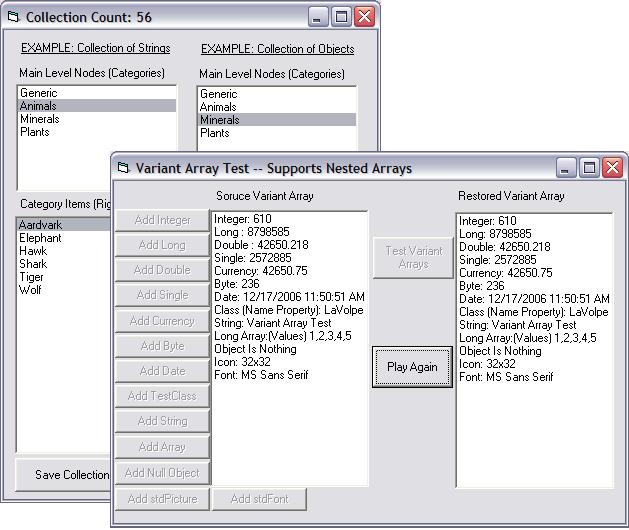



## LaVolpe Collection Class

### Description

Updated: See end of description for change... A hybrid collection class that kind of combines a TreeView collection (nodes and heirarchy) and the standard VB collection object. Supports arrays, objects &amp; classes. The project exposes over 30 methods/properties to assist in managing the collection. It even has the ability of persisting the collection. Please play and offer suggestions and report bugs. Don't forget to review the RTF document included. 7Dec06::Added SortCollection &amp; IndexFromKeyIndex routines. AddItem,MoveItem now allow sorting too. 14Dec06: Overhauled array serialization. Now supports all arrays, even supports nested variant arrays. Only user intervention would be serialization of your objects, if applicable. Added another test form to test Variant Arrays. 15Dec06::Reference counts on deserialized objects were not always correct. Fixed. 17Dec06: Added support to save stdPic/stdFont objects too. Final version, barring bugs/enhancements.
 
### More Info
 

             |
---                |---
**Submitted On**   |2006-12-17 11:53:16
**By**             |[LaVolpe](https://github.com/Planet-Source-Code/PSCIndex/blob/master/ByAuthor/lavolpe.md)
**Level**          |Intermediate
**User Rating**    |5.0 (80 globes from 16 users)
**Compatibility**  |VB 6\.0
**Category**       |[Miscellaneous](https://github.com/Planet-Source-Code/PSCIndex/blob/master/ByCategory/miscellaneous__1-1.md)
**World**          |[Visual Basic](https://github.com/Planet-Source-Code/PSCIndex/blob/master/ByWorld/visual-basic.md)
**Archive File**   |[LaVolpe\_Co20381712172006\.zip](https://github.com/Planet-Source-Code/lavolpe-lavolpe-collection-class__1-67312/archive/master.zip)

